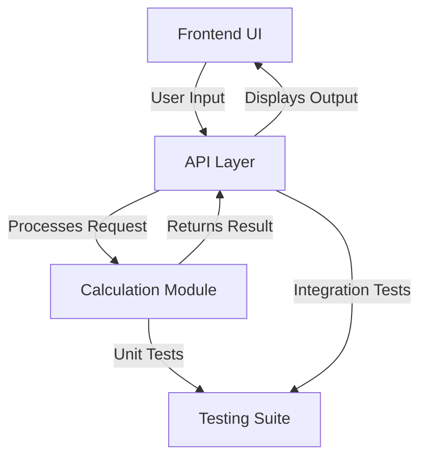

# Ian Gans - Project Planning Document

## First Prompt

**Prompt:**
Create a planning document for a Python calculator web application that will be a collaborative project and must meet the design and SOLID principles. It should allow for a team of 3 - 6 members who will be using GitHub for version control. We will add features in future sprints but for now will just address the fundamental calculation addition, subtraction, multiplication, and division.

**Response:**
### Project Overview
This project is a collaborative Python-based calculator web application that follows the SOLID design principles and enables multiple developers to contribute efficiently. The project will be managed via GitHub, with version control and branching strategies in place. Future sprints will introduce additional features, but the initial focus is on core arithmetic operations.

### Key Features:
- Addition
- Subtraction
- Multiplication
- Division

### Team Roles & Responsibilities
1. **Project Manager** - Oversees progress, assigns tasks, and manages sprint planning.
2. **Backend Developer** - Implements core calculation logic.
3. **Frontend Developer** - Designs the UI/UX for the web interface.
4. **Tester** - Ensures quality assurance via unit and integration testing.
5. **DevOps Engineer** - Manages deployment and CI/CD pipeline.
6. **Documentation Specialist** - Maintains project documentation.

---

## Second Prompt

**Prompt:**
The project will have parallel testing and should be structured to allow multiple programmers while adhering to the design and SOLID principles. What specifically should happen? Create a recommended specific structure diagram using Mermaid that will allow features to be added with minimum conflict and allow for testing.

**Response:**

---

## Third Prompt

**Prompt:**
How should the project and GitHub folders be structured to meet the above?

**Response:**
```
calculator-app/
├── src/
│   ├── frontend/
│   │   ├── index.html
│   │   ├── styles.css
│   │   ├── app.js
│   ├── backend/
│   │   ├── main.py
│   │   ├── calculator.py
│   │   ├── api.py
│   ├── tests/
│   │   ├── test_calculator.py
│   │   ├── test_api.py
├── docs/
│   ├── README.md
│   ├── design-doc.md
├── .github/
│   ├── workflows/
│   │   ├── ci.yml
├── requirements.txt
├── .gitignore
├── LICENSE
```
---

## Fourth Prompt

**Prompt:**
Add a stub for future features for a financial calculator.

**Response:**
```python
def future_financial_features():
    # Placeholder for financial calculations
    pass
```

---

## Fifth Prompt

**Prompt:**
Make sure the operations are also added above.

**Response:**
```python
def add(a, b):
    return a + b

def subtract(a, b):
    return a - b

def multiply(a, b):
    return a * b

def divide(a, b):
    if b != 0:
        return a / b
    else:
        return "Error: Division by zero"
```

---

## Sixth Prompt

**Prompt:**
Create a draft test plan for the above with recommended test cases.

**Response:**
### Test Plan
#### Unit Tests
| Test Case | Input | Expected Output |
|-----------|-------|----------------|
| Addition | (2,3) | 5 |
| Subtraction | (5,2) | 3 |
| Multiplication | (4,3) | 12 |
| Division | (6,2) | 3 |
| Division by Zero | (5,0) | "Error: Division by zero" |

#### Integration Tests
- Ensure API endpoints return correct responses for calculations.
- Validate frontend input handling and display of results.
- Test database or state storage if applicable.

---

## Seventh Prompt

**Prompt:**
Your choice.

**Response:**
### CI/CD Pipeline Strategy
To maintain quality and efficiency, we will integrate GitHub Actions for continuous integration and automated testing. A CI/CD pipeline will be set up to:
- Run unit tests on every push.
- Ensure code linting and formatting compliance.
- Deploy stable releases to a staging environment before production.

```yaml
name: CI Pipeline
on: [push, pull_request]
jobs:
  test:
    runs-on: ubuntu-latest
    steps:
      - uses: actions/checkout@v3
      - name: Set up Python
        uses: actions/setup-python@v3
        with:
          python-version: "3.10"
      - name: Install dependencies
        run: pip install -r requirements.txt
      - name: Run tests
        run: pytest
